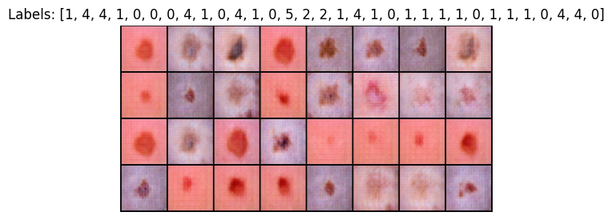

# Conditional WGAN-GP for Image Generation

[](LICENSE)
[](https://www.python.org/downloads/)
[](https://pytorch.org/)

This project implements a conditional Wasserstein GAN with gradient penalty (cWGAN-GP) for generating images based on class labels. The model takes random noise and a class label as input and generates realistic synthetic images.

## Table of Contents

- [Overview](#overview)
- [Model Architecture](#model-architecture)
  - [Generator](#generator)
  - [Discriminator](#discriminator)
- [Installation](#installation)
- [Usage](#usage)
  - [Downloading Pre-trained Weights from Kaggle](#downloading-pre-trained-weights-from-kaggle)
- [Training](#training)
- [Evaluation](#evaluation)
- [Contributing](#contributing)
- [License](#license)
- [Acknowledgments](#acknowledgments)

## Overview

The cWGAN-GP model is trained to generate realistic images based on a provided class label. The model learns to capture the characteristics and variations of different classes and generates synthetic images that resemble real images from those classes.

## Model Architecture

### Generator

The generator takes random noise and a class label as input and generates a synthetic image. The architecture of the generator can be described as follows:

- Noise input branch: Convolutional transpose layers to upsample the noise.
- Class label input branch: Embedding layer to encode the class label.
- Concatenation of the processed noise and class label.
- Batch normalization and ReLU activation after each convolutional transpose layer.
- Tanh activation at the output to generate the final image.

### Discriminator

The discriminator takes an image and a class label as input and predicts whether the image is real or generated. The architecture of the discriminator can be described as follows:

- Image input branch: Convolutional layers to extract features from the image.
- Class label input branch: Embedding layer to encode the class label.
- Concatenation of the processed image features and class label.
- Instance normalization and leaky ReLU activation after each convolutional layer.
- Final convolutional layer to produce the discriminator output.

## Installation

1. Clone the repository:

   ```shell
   git clone https://github.com/sm1899/cwgan-gp-image-generation.git
   cd cwgan-gp-image-generation
   ```

2. Install the required dependencies:

   ```shell
   pip install -r requirements.txt
   ```

## Usage


### Downloading Pre-trained Weights from Kaggle

You can download pre-trained weights for the cWGAN-GP model from Kaggle using the KaggleHub library. To download the weights, follow these steps:

1. Install the KaggleHub library:

   ```shell
   pip install kagglehub
   ```

2. Download the latest version of the pre-trained weights:

   ```python
   import kagglehub

   path = kagglehub.model_download("moisougata/gan_weights/pyTorch/gan-and-classification")
   print("Path to model files:", path)
   ```

   This will download the pre-trained weights to the specified path.

3. Load the pre-trained weights into your model before generating images or continuing training.

## Training

- Alternate between updating the critic (discriminator) and the generator.
- Use the WGAN-GP loss with gradient penalty for stable training.
- Experiment with different hyperparameters and architectures to achieve the best results.
- Monitor the training progress by saving generated images and evaluating metrics.


## Results
Here are some example results of the generated images using the cWGAN-GP model:



The generated images demonstrate the model's ability to capture the characteristics and variations of different classes. The images exhibit realistic textures, shapes, and colors that closely resemble real images from the respective classes.

## Evaluation(todo)

- Assess the quality and diversity of the generated images using metrics such as Inception Score (IS) and Fréchet Inception Distance (FID).
- Visualize the generated images to qualitatively evaluate their realism and coherence.

## License

This project is licensed under the [MIT License](LICENSE).

## Acknowledgments

- The implementation is based on the paper "Improved Training of Wasserstein GANs" by Gulrajani et al. (https://arxiv.org/abs/1704.00028).
- Thanks to the open-source community for providing valuable resources and inspiration.

Feel free to customize and expand upon this README file based on your specific project details and requirements.
